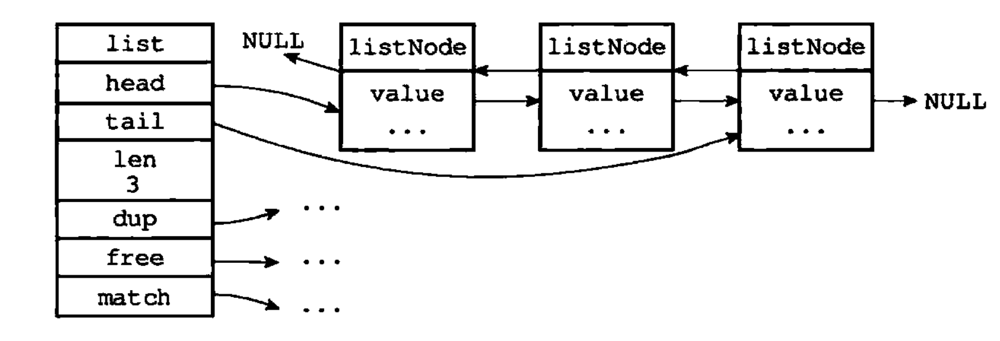

# Redis复习

## 结构类型
https://zhuanlan.zhihu.com/p/140726424
---

### SDS简单动态字符串

文件：
- `src/sds.h`
- `src/sds.c`

redis中存储的字符串类型，且类型是可修改的时候，都是由sds结构构成的。
```c
struct __attribute__ ((__packed__)) sdshdr8 {
    uint8_t len; /* 已使用的空间大小 */
    uint8_t alloc; /* 排除头和空结束符，申请的大小 */
    unsigned char flags; /* 使用三个比特位区分 sdshdr8\16\32\64 */
    char buf[]; /* 申请到的连续内存空间 */
};
```

例如： char buf[]='r','e','d','i','s','\0'

使用时候,内容数据依然是按照C语言存储的，'\0'虽然会分配一个空间，但是对于使用时候来说是透明的，且不计算在alloc里面，工作全部是sds完成的。因此该结构存储的好处在以下几点：

- 常数复杂度获取字符串长度。因为有len字段
- 杜绝缓冲区溢出。修改需要扩容时，会优先判断空间是否足够，再进行处理。
- 减少修改字符串长度时所需的内存重分配次数。空间预分配和惰性释放，预分配在len小于1MB时候，双倍扩容，否则，每次新增1MB。
- 二进制安全。
- 兼容部分C字符串函数。

---
### 压缩链表
其中每个entry都是由previous_entry_length、encoding、content三个组成。

previous_entry_length：前一个节点的长度，可以是1个字节或者5个字节，如果前一个节点长度小于254字节，就为1，否则为5。通过previous_entry_length可以知道前一个节点的地址（当前地址减去previous_entry_length）。
encoding：节点的encoding属性记录了节点的content属性所保存数据的类型以及长度。
encoding是一字节、两字节或者五字节长时，值的最高位为00、01或者10的是字节数组编码：这种编码表示节点的content属性保存着字节数组，数组的长度由编码除去最高两位之后的其他位记录；
encoding是一字节长时，值的最高位以11开头的是整数编码：这种编码表示节点的content属性保存着整数值，整数值的类型和长度由编码除去最高两位之后的其他位记录。
content：节点的值。

高位00表示 content是一个字节数据，后6位010011等于11，表示content的长度
11表示是个数字
### 链表

文件:
- `adlist.h`
- `adlist.c`

```c

/* Node, List, and Iterator are the only data structures used currently. */

typedef struct listNode {
    struct listNode *prev;
    struct listNode *next;
    void *value;
} listNode;

typedef struct listIter {
    listNode *next;
    int direction;
} listIter;

typedef struct list {
    listNode *head;
    listNode *tail;
    void *(*dup)(void *ptr);
    void (*free)(void *ptr);
    int (*match)(void *ptr, void *key);
    unsigned long len;
} list;
```
list结构示意图


Redis的链表实现的特性可以总结如下：
 - 双端：链表节点带有prev和next指针，获取某个节点的前置节点和后置节点的复杂度都是O（1）。
 - 无环：表头节点的prev指针和表尾节点的next指针都指向NULL，对链表的访问以NULL为终点。
 - 带表头指针和表尾指针：通过list结构的head指针和tail指针，程序获取链表的表头节点和表尾节点的复杂度为O（1）。
 - 带链表长度计数器：程序使用list结构的len属性来对list持有的链表节点进行计数，程序获取链表中节点数量的复杂度为O（1）。
 - 多态：链表节点使用void*指针来保存节点值，并且可以通过list结构的dup、free、match三个属性为节点值设置类型特定函数，所以链表可以用于保存各种不同类型的值。
